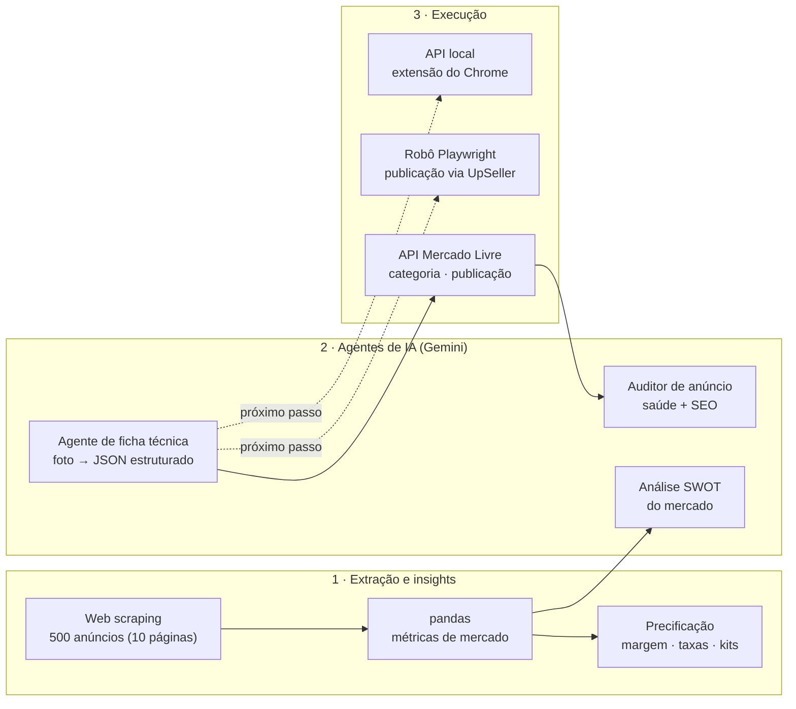

# 🤖 Marketplace Intelligence — Agentes de IA para E-commerce

### Extração de dados de mercado, inteligência de preço e agentes de IA que criam, auditam e publicam anúncios no Mercado Livre

[](https://github.com/diaquinodev/radar-marketplace/actions/workflows/ci.yml)
[](requirements.txt)
[](https://ai.google.dev/)
[](app/radar_app.py)
[](rpa/upseller_bot.py)
[](https://developers.mercadolivre.com.br/)

---

## 📌 O problema

Para uma loja de moda que vende no Mercado Livre, cada novo produto exigia horas de trabalho manual:

1. **Pesquisar a concorrência:** preços, volume de vendas e quem domina a busca.
2. **Precificar** sem perder margem depois das taxas do marketplace e das promoções.
3. **Criar o anúncio:** título com SEO, ficha técnica, categoria correta, fotos e descrição.
4. **Acompanhar a saúde do anúncio** e corrigir o que o Mercado Livre penaliza.

## 💡 A solução

Um conjunto de módulos que **extrai dados, gera insights e usa agentes de IA** em cada etapa, do radar de mercado à publicação.



## ⚙️ Módulos

| Módulo | Arquivo | O que faz |
| :--- | :--- | :--- |
| **Radar de mercado** | [`app/radar_app.py`](app/radar_app.py) | Dashboard **Streamlit** que extrai até **500 anúncios** de uma busca (10 páginas), consolida preço, desconto, vendas e avaliação com **pandas**, exporta CSV e mostra quem concentra as vendas. |
| **Inteligência de preço** | `get_factory_bi` | A partir do custo, calcula preço mínimo, preço-alvo, preço de vitrine com "gordura" para promoção, desconto máximo, lucro real e preço de kit com 3 peças, já descontando taxas do marketplace. |
| **SWOT com IA** | `app/radar_app.py` | O **Gemini** (`gemini-2.5-flash`) recebe as métricas do mercado e devolve uma análise SWOT numérica para posicionar o produto. |
| **Agente de ficha técnica** | [`agentes/agente_ficha_tecnica.py`](agentes/agente_ficha_tecnica.py) | Lê as **fotos da peça** com o **Gemini** (`gemini-2.5-flash`) e gera título, descrição, tecido, modelo e tipo de manga como **saída estruturada validada com Pydantic**. Depois descobre a categoria oficial, hospeda as fotos no ImgBB e publica pela API do Mercado Livre. |
| **Auditor de anúncio** | [`agentes/auditor_anuncio.py`](agentes/auditor_anuncio.py) | Coleta dados, descrição e **indicador de saúde** de um anúncio na API e pede ao **Gemini** (`gemini-1.5-flash`, modelo usado hoje neste módulo) um laudo de conversão, regras do marketplace e SEO. |
| **Robô de publicação (RPA)** | [`rpa/upseller_bot.py`](rpa/upseller_bot.py) | Automação com **Playwright** que faz login no UpSeller e cadastra o anúncio completo (informações, preço, estoque, fotos e variantes), com modo `--headless` e `--debug` com screenshots por etapa. |
| **Integrações** | [`integracoes/`](integracoes/) | OAuth 2.0 do Mercado Livre (gera `meli_tokens.json`) e descoberta da categoria oficial a partir de um termo. |
| **API local** | [`api/jarvis_api.py`](api/jarvis_api.py) | Servidor HTTP com CORS liberado que entrega o `dados_jarvis.json` (título, preço e descrição) para uma **extensão do Chrome** preencher formulários. Formato em [`api/dados_jarvis.example.json`](api/dados_jarvis.example.json). |

## 🚀 Como executar

Pré-requisito: Python 3.11+.

```bash
python -m venv .venv && .venv\Scripts\activate
pip install -r requirements.txt
playwright install chromium
copy .env.example .env                     # preencha as chaves
```

Execute sempre a partir da raiz do projeto:

| Comando | O que faz |
| :--- | :--- |
| `streamlit run app/radar_app.py` | Abre o radar de mercado (a chave do Gemini é informada na própria tela) |
| `python integracoes/mercadolivre_oauth.py TG-xxxx` | Gera o token de acesso do Mercado Livre |
| `python agentes/agente_ficha_tecnica.py` | Cria e publica um anúncio a partir das fotos em `fotos_produto/` |
| `python agentes/auditor_anuncio.py` | Pede o código MLB e audita o anúncio |
| `python rpa/upseller_bot.py --debug` | Publica pelo UpSeller, parando em cada etapa |
| `python api/jarvis_api.py` | Sobe a API local da extensão na porta 8000 (lê `dados_jarvis.json` da raiz) |

## 🔐 Segurança e boas práticas

- Todas as credenciais (Gemini, Mercado Livre, ImgBB, UpSeller) vêm do **`.env`**, fora do Git; o [`.env.example`](.env.example) lista cada uma.
- Tokens, bancos locais e screenshots de depuração são ignorados pelo `.gitignore`.
- A coleta de dados públicos deve respeitar os termos de uso do marketplace e limites de requisição. Para uso contínuo, prefira a API oficial.

## 🧭 Próximos passos

- **Orquestrador de agentes:** unir radar, precificação, ficha técnica, auditoria e publicação num único fluxo com etapas de aprovação humana.
- Persistir o histórico do radar em banco para acompanhar preços e concorrentes ao longo do tempo.
- Ampliar a cobertura de testes: já cobrem a precificação (`get_factory_bi`), a limpeza de vendas, o parser do scraper (com HTML simulado) e o schema Pydantic da ficha técnica; faltam agentes, integrações e RPA, que dependem de APIs externas.

## 🧪 Testes

```bash
pip install -r requirements-dev.txt
pytest
```

Os testes rodam sem rede e sem chaves de API (o scraper é testado com HTML simulado) e também executam no CI a cada push.

## 📁 Estrutura

```
├── app/radar_app.py                  # Dashboard Streamlit: scraping, BI de preço, SWOT e cadastro com IA
├── agentes/
│   ├── agente_ficha_tecnica.py       # Foto → ficha técnica estruturada → publicação
│   └── auditor_anuncio.py            # Laudo de saúde e SEO de anúncios
├── rpa/upseller_bot.py               # Publicação automatizada via Playwright
├── integracoes/
│   ├── mercadolivre_oauth.py         # OAuth 2.0 do Mercado Livre
│   └── descobrir_categoria.py        # Categoria oficial por termo
├── api/jarvis_api.py                 # API local para a extensão do Chrome
├── tests/                            # Testes automatizados (pytest)
├── .github/workflows/ci.yml          # CI: pytest em Python 3.12
├── requirements.txt
├── requirements-dev.txt              # Dependências + pytest
└── .env.example
```

---
Desenvolvido por **Diego Aquino** · [GitHub](https://github.com/diaquinodev) · [LinkedIn](https://linkedin.com/in/diegoaquino87)
